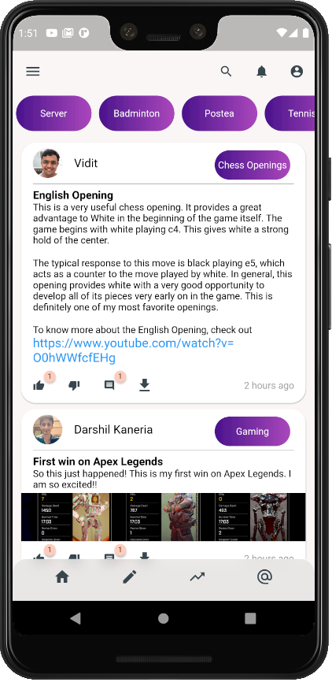

# What is PosTea?

PosTea is a social media platform which is actively being developed. It is aimed at providing the users with an environment where people with similar interests can gather at a topic and share their content. We do not want this to be our main goal though, so we have a more relaxed timeline where users can post without being subscribed to a topic and see posts from different users that they follow. The topic independence allows users to customize their timeline according to their tastes, be it a particular person or an entire topic. PosTea is currently accessible on Android and Web.

# How to install?

We do not currently have an apk file for you to install. If you want to be a contributor to this repository, please contact **Darshil Kaneria** (@imemyself2 on GitHub).

After you have the instructions to access the resources, there's not much to do:
1. Make sure you have the correct version of Flutter installed. Currently, we can only guarantee the proper functioning of PosTea with Flutter version **v1.20.4 for Android** and **v1.24.0-10.2.pre for Web**. Some dependencies may break if you use a newer or older version. We are aware of this issue and are actively working on resolving it.
2. In the root directory (front-end/postea_frontend/), run **flutter pub get**.
3. After the dependencies have resolved successfully, 
	- For Android, simply run **flutter run**
	- for Web, run **flutter build web** and then, run **flutter run -d \<device of your choice\> --web-port=\<port_no\>**. Make sure the url provided for CORS is adjusted accordingly in main.js.

You should have the app running now. Create an account and start exploring. We'd be glad to check out your contributions to PosTea!

